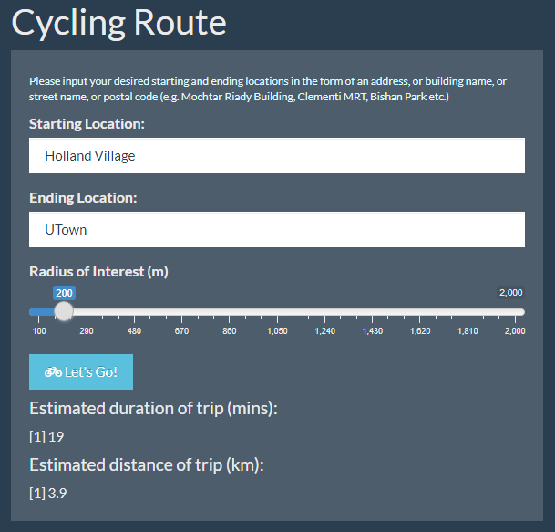
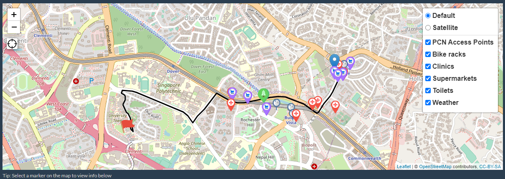
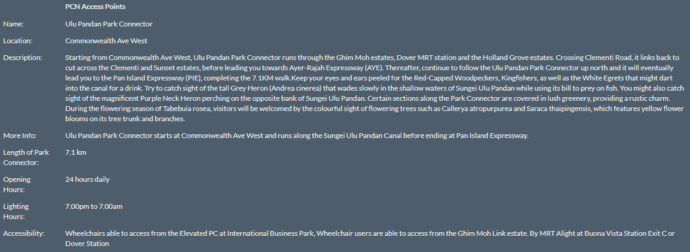
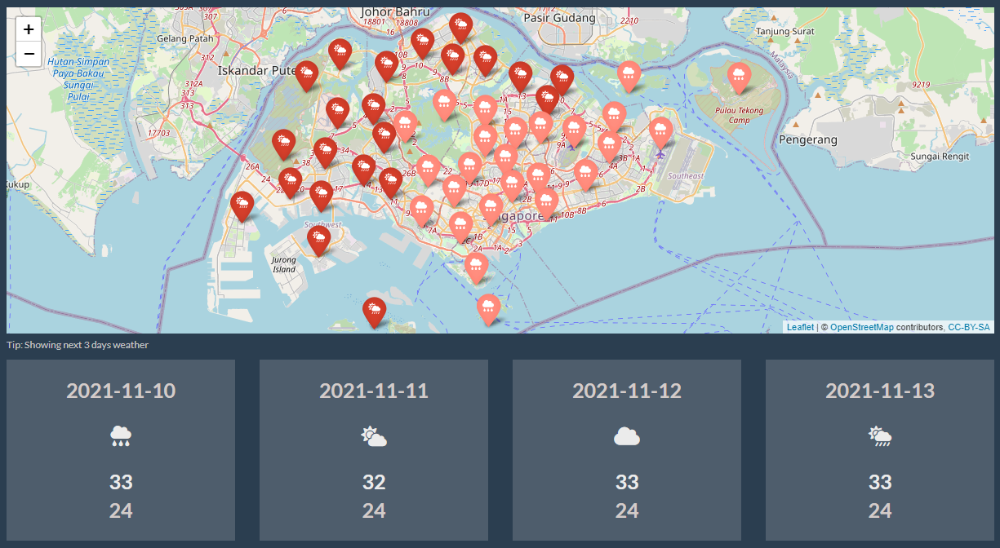

# **Introduction**
### **Problem Statement**
In 2015, the Sustainable Singapore* Blueprint revealed a detailed 15-year plan for Singapore to move towards being a ‘car-lite’ city. It aims to reduce reliance on motorised vehicles and decrease carbon emissions by shifting the default choices for transport to public transport, walking and cycling (NCCS, 2015). To achieve this, the Singaporean government will introduce innovative features and designs across the region to develop a better and more comprehensive cycling network, spanning more than 1,320km by 2030 (NCCS, 2015). This has encouraged more people to use bicycles as a form of transportation. With COVID-19, the demand for cycling has also increased exponentially. At the height of the pandemic, many people took up cycling as a means of exercising amid the restrictions. The sale of bicycles and cycling gear at Decathlon was reported to have doubled during the pandemic as compared to 2020 (Chua, 2021). Even bike-sharing operators such as Anywheel have seen an increase in its ridership for every month last year (Abdullah, 2020).  
  
For veteran and beginner cyclists alike, route planning is essential and especially so for longer travel distances. In the current market for cycle route planning apps, there are options that offer the basic service of route planning such as Bikemap, Strava, Cyclers Navigate and Google Maps. However, there is no readily accessible, comprehensive app on the market that provides additional features to enhance the rider’s journey, such as weather forecasting or pins to indicate nearby points of interest. Most of such comprehensive apps, if any, are often not available for free either on the Apple App Store or Google Play Store, which discourages users from downloading them. Additionally, typical apps only help to plan routes without accounting for potential obstacles like inclement weather which may affect the cyclist’s journey. Furthermore, most of these apps are created by companies based overseas and hence may not be localised enough to a Singaporean setting.  

### **Background of ezBikes**
To address these gaps in the current market, the aim of ezBikes is to be an all-in-one app that allows cyclists to conveniently map a detailed cycling route to their desired location. The ezBikes app proactively offers value-adding features to make the journey more comfortable such as the weather forecast, and various pinned locations en route for food options, medical attention or toilet breaks as needed. In the internet age, users are often bombarded with a deluge of information. Hence, ezBikes is tailored to show only relevant information such as nearby points of interest specific to their cycling journey.  
 
 
  
  
# **Data Preparation**
ezBikes’ data preparation process involved web crawling, combining, and cleaning data from a variety of sources. The datasets used are in the kml, csv and json formats. Specifically, ezBikes features information about park connector access points, public toilets, bicycle racks, supermarkets, clinics and the weather forecast.  
  
### **Park Connectors (PCN) Access Points**
The “pcn_access_points.csv” dataset is adapted from https://data.gov.sg/dataset/pcn-access-points which is available in kml format. The rmd file titled “PCN Access Points_Cleaned” contains the codes used to crawl and clean the kml dataset, obtaining the longitude, latitude and address of each park connector access point. After cleaning the base kml dataset, another web crawl was performed on https://www.nparks.gov.sg/gardens-parks-and-nature/park-connector-network to obtain the description, location details, opening hours, lighting hours and accessibility features of each listed park connector. Data cleaning was performed again on the newly crawled data, which produced the final data file referenced in the app titled “pcn_access_points.csv”.  
  
### **Public Toilets**
The “toilets.csv” dataset is adapted from https://www.toilet.org.sg/loomapdirectory. The rmd file titled “toilets_cleaned” contains the codes used to crawl the website data. Alongside the data cleaning functions, it uses geocode functions to obtain the longitude, latitude and addresses of all public toilets in Singapore.  
  
### **Bicycle Racks**
The “bike_racks.csv” dataset is adapted from https://data.gov.sg/dataset/lta-bicycle-rack. The rmd file titled “bike_racks” contains the codes used to crawl and clean the kml dataset, obtaining the longitude, latitude, addresses and the number of racks available at each bicycle rack.  
  
### **Supermarkets**
The “supermarkets.csv” dataset is adapted from https://data.gov.sg/dataset/listing-of-licensed-supermarkets. The rmd file titled “supermarkets_cleaned.csv” contains the codes used to clean the csv dataset. Geocode functions were implemented on the cleaned data to obtain the longitude, latitude and addresses of each supermarket.  
  
### **Clinics**
The “clinics.csv” dataset is adapted from https://data.gov.sg/dataset/chas-clinics?view_id=5cbf5325-26d2-4e3b-a54d-e20d6d07dcd2&resource_id=21dace06-c4d1-4128-9424-aba7668050dc. The rmd file titled “clinics_cleaned” contains the codes used to crawl and clean the kml dataset, obtaining the longitude, latitude, postal code and address of each clinic. The clinics in this dataset lists only the clinics that provide the Community Health Assist Scheme (CHAS).  
  
### **Weather Forecast**
The app interface allows the user to retrieve live weather forecasts for the next 2 hours for the districts of interest along their recommended biking path. This weather forecast data is queried from a live API database from https://data.gov.sg/dataset/weather-forecast. Since the API data continuously produces updated weather forecasts as the day progresses, data cleaning for the weather dataset occurs in the app server itself after the user inputs their trip details. This allows the app to continuously reflect the most current weather forecasts available at a granular level.  
 
 
  
  
# **ezBikes App**
The ezBikes App is a one-stop application for cyclists in Singapore. In addition to displaying a recommended cycling route for users, the app provides convenience and enhances the user experience through unique value-added services. ezBikes’ main target audience for the current version of this app are residents in Singapore. However, the app can potentially be expanded to other countries as well.  

### **Features**
On top of planning a cycling route for the user, ezBikes aims to enhance their overall experience when using the app on their journey. As such, the app considers the perspectives of cyclists and takes their needs into consideration when deciding on the essential features to include within its interface. Below are the 6 main features ezBikes supports:  
  
  
Firstly, ezBikes will display the location of nearby Park Connector (PCN) Access Points marked out on the map. This allows users to be aware of the closest entry points to parks in the event that they have time to spare and decide to have a leisurely ride around a park.  
  
  
Next, the locations and details of nearby public toilets will also be available on the map. This information will bring extensive convenience to users, who would otherwise have to blindly cycle around searching for an available toilet. With this feature, users can view all the nearby toilets at a glance on ezBikes, allowing them to quickly and easily find their way to the nearest toilet.  
  
  
ezBikes will also be equipped with the locations of nearby bicycle racks. A major concern for cyclists is ensuring the security of their bicycles when left unattended. This highlights the importance of proper facilities for cyclists to secure their bicycles. As such, this feature on the app will greatly benefit the users as they can easily find the closest available and low-traffic bicycle rack to park their bicycles when necessary.  
  
  
While cycling, it is highly likely that cyclists will require refreshments. ezBikes will also display the locations of nearby supermarkets, allowing users to navigate to the nearest supermarket to replenish on food and drinks, which may improve the comfort of their trip.  
  
  
Additionally, ezBikes will also show locations of nearby clinics. While cycling, there is a possibility that cyclists may sustain injuries due to minor accidents like falls. In the event such accidents occur, users can use ezBikes to find the nearest clinic to receive treatment for their injuries.  
  
  
Lastly, when travelling by bicycle, cycling paths will not be sheltered most of the time. As such, it is paramount for cyclists to check on the weather conditions prior to their journey. ezBikes displays the 2-hour weather forecasts for each area in Singapore at a granular level. This allows users to be informed on the weather conditions along their planned route so they can make suitable preparations or change their travel plans in the event of poor weather.  
  
  
  
### **App Functions**
##### Flexible and Dynamic Input Options 
Users can input their chosen starting and ending points in the form of an address, postal code, street name or building name. The text input bars do not have any restrictions or require a fixed format, hence is highly flexible and easily usable by the end users. Upon clicking the ‘Let’s Go!’ button, a recommended cycling route will be displayed on the map, along with an estimated trip duration in minutes, as well as the estimated distance of the trip in kilometers. Equipping users with the information on the estimated duration of their cycling journey can facilitate a smoother trip planning process.  
  
  
  
##### Tailored Fitting Options
Given the plethora of features available on ezBikes, it is important that users can filter through them and efficiently find the information they are looking for. The checkboxes located on the right of the map will allow users to deselect the features they do not require, thus reducing clutter on the map.  
  
  
Additionally, users will also be able to freely toggle between satellite and map views with full zooming functionalities. They can click on the locator icon on the left of the map to find their current location. This feature enhances the user experience as they can determine their position relative to their planned route in real time, to know if they have strayed off from the planned route. ezBikes’ built-in GPS will also help them to find their way in case they get lost while cycling, which is much more convenient than having to switch to other GPS applications.  

  

##### **PCN Access Points**
Each point displays the location details, opening hours, lighting hours, accessibility options and a brief description highlighting the special features of the selected park connector.  
  
  
##### **Public Toilets**
Each point displays the address of the selected public toilet.  
  
  
##### **Bicycle Racks**
Each point displays the number of bicycle racks available and the full address of the selected public bicycle rack.  
  
  
##### **Supermarkets**
Each point displays the address of the selected supermarket.  
  
  
##### **Clinics**
Each point displays the clinic name and full address of the selected clinic.  

  
  
##### **Weather Forecast Pins**
Each point showcases the real-time weather state for each district in Singapore. We chose the 2-hour forecast API as it offers a higher level of granularity (e.g. Bishan, Queenstown, etc.) compared to the 24-hour forecasts API which only provides generalised weather conditions in 5 regions (North, South, East, West, Central). By default, the weather forecast will be accurate to 2 hours into the future from the instant users generate the cycling route. 
  
  
##### **Weather Forecast Tab**
Under the weather forecast tab, we visualized the 2-hour forecast over the entire map of Singapore for a more intuitive viewing experience. The different weather conditions are colour coded so that users can see how the weather might change across different areas, and be prepared for their trip.
  
In addition, users can gain insights on the average weather condition over the next 3 days from their selected date, including the lowest and highest temperature for each day.  

  
As discussed in the Problem Statement section above, most of the existing apps and online services merely allow for basic route planning. As such, the presence of ezBikes’ value-adding features creates utility for end users and can give the application an edge in the market.  
 
 
  
  
# **Features Coming in ezBikes v2.0**
To further deliver on ezBikes’ value proposition of aggregation and relevance, version 2.0 of the app will include these additional features:  
  
### **Danger Zones**
ezBikes will use public data to preserve the welfare of users. It will show users areas to avoid, such as recent dengue or COVID clusters and construction areas.  
  
  
### **Intelligent Planning**
Currently ezBikes optimizes short-term planning by providing relevant, real-time data. However, it can be enhanced to provide the same level of services for future planned trips. This would include features like upcoming opening dates of new park connector lines, more accurate future weather forecast, and usage of machine learning models to project future virus hotspots based on recent trends.  
  
  
### **User Customization**
Users will be able to create an account on ezBikes and share their trips on popular fitness social media platforms like Strava, Google Fit, RunKeeper, etc. ezBikes will also use recommendation algorithms to recommend users parks and routes they are likely to enjoy based on their previous rides.  
  
  
### **More Comprehensive Datasets**
In the Singaporean context, the clinics in ezBikes v1.0 only include Community Health Assist Scheme (CHAS) clinics. This will be expanded to include all healthcare facilities under the Ministry of Health. In the global context, ezBikes serves as a general system for finding relevant locations near a given route. Similar datasets can be crawled for other countries and will integrate seamlessly with the existing infrastructure of our app, making expanding ezBikes into other countries quick and effective.  
 
 
  
  
# **References**
Abdullah, A. Z.(2020, August 25). Singapore sees cycling boom amid COVID-19, with increased ridership and bicycle sales. Channel News Asia. https://www.channelnewsasia.com/singapore/covid-19-cycling-popularity-bicycle-sales-shared-bikes-631621  
  
  
Chua, N. (2021, July 5). Ride on cycling boom to push for car-lite society: Experts. The New Paper. https://tnp.straitstimes.com/news/singapore/ride-cycling-boom-push-car-lite-society-experts  
  
  
D. Kahle and H. Wickham. (2013, June). ggmap: Spatial Visualization with ggplot2. The R Journal, 5(1), 144-161. http://journal.r-project.org/archive/2013-1/kahle-wickham.pdf  
  
  
National Climate Change Secretariat. (2015). Sustainable Singapore Blueprint: Our Home, Our Environment, Our Future. https://www.nccs.gov.sg/docs/default-source/default-document-library/sustainable-singapore-blueprint-2015.pdf  

